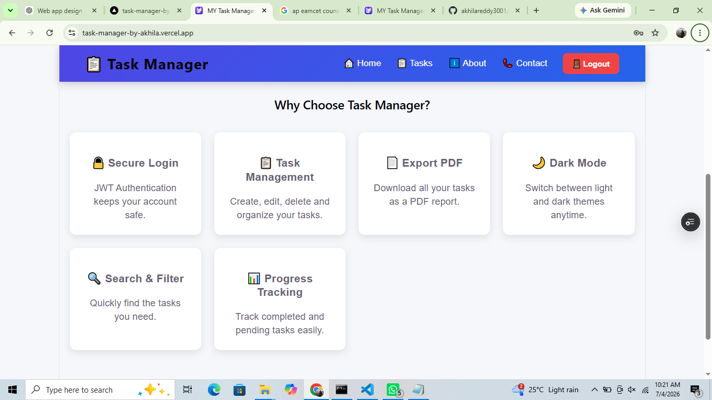
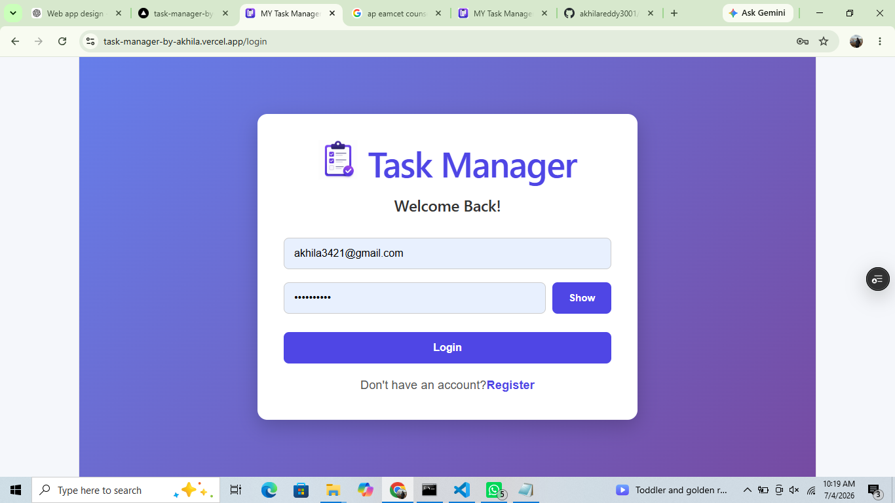
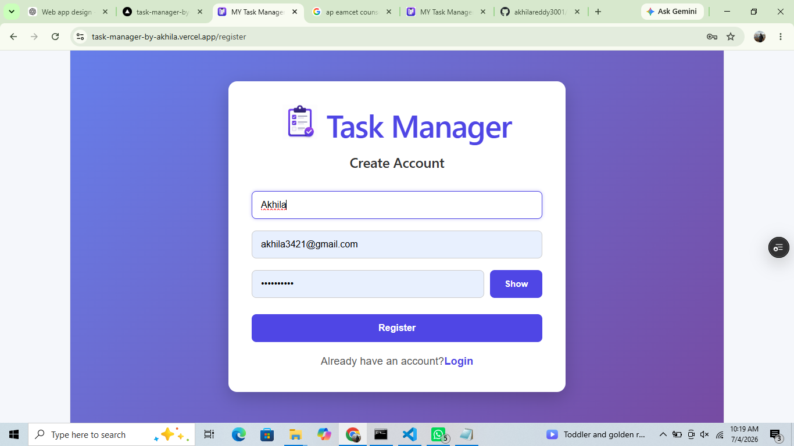
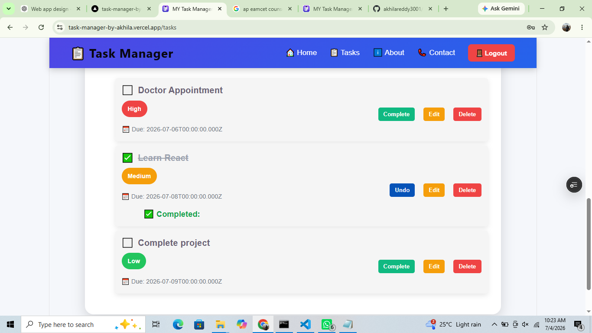
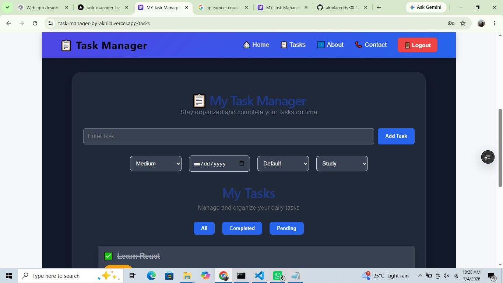

# 📋 Task Manager

> A secure and modern full-stack Task Management web application built using the **MERN Stack (MongoDB, Express.js, React.js, and Node.js)**. It enables users to manage daily tasks with secure authentication, task prioritization, categories, search, filtering, progress tracking, dark mode, and PDF export.


---

# 🚀 Live Demo

### 🌐 Frontend
https://task-manager-by-akhila.vercel.app

### ⚙️ Backend API
https://task-manager-backend-y8xu.onrender.com

### 📂 GitHub Repository
https://github.com/akhilareddy3001/task-manager-by-akhila

---

# 📸 Screenshots

## 🏠 Home Page



---

## 🔐 Login Page



---

## 📝 Register Page



---

## 📋 Task Dashboard



---

## 🌙 Dark Mode


---

# ✨ Features

- 🔐 Secure User Authentication (JWT)
- 👤 User Registration & Login
- 📋 Create Tasks
- ✏️ Edit Tasks
- 🗑️ Delete Tasks
- ✅ Mark Tasks as Completed
- 📂 Task Categories
- 🚩 Priority Levels
- 📅 Due Date Management
- 🔍 Search Tasks
- 🎯 Filter Completed & Pending Tasks
- 🌙 Dark Mode
- 📊 Task Progress Tracking
- 📄 Export Tasks to PDF
- 🚪 Secure Logout

---

# 🛠 Tech Stack

## Frontend

- React.js
- React Router DOM
- Axios
- React Toastify
- CSS3

## Backend

- Node.js
- Express.js
- JWT Authentication
- bcryptjs

## Database

- MongoDB Atlas
- Mongoose

## Deployment

- Vercel
- Render
- GitHub

---

# 📂 Project Structure

```text
TaskManager
│
├── client
│   ├── public
│   ├── src
│   │   ├── api
│   │   ├── assets
│   │   ├── components
│   │   ├── pages
│   │   ├── utils
│   │   └── App.jsx
│   └── package.json
│
├── server
│   ├── controllers
│   ├── middleware
│   ├── models
│   ├── routes
│   ├── server.js
│   └── package.json
│
└── README.md
```

---

# ⚙️ Installation

## Clone the Repository

```bash
git clone https://github.com/akhilareddy3001/task-manager-by-akhila.git
```

## Install Frontend

```bash
cd client
npm install
```

## Install Backend

```bash
cd ../server
npm install
```

## Create Environment Variables

Create a `.env` file inside the **server** folder.

```env
MONGO_URI=Your_MongoDB_Atlas_Connection_String
JWT_SECRET=Your_JWT_Secret_Key
```

## Start Backend

```bash
npm start
```

## Start Frontend

```bash
cd ../client
npm run dev
```

---

# 🎯 Skills Demonstrated

- React Components
- React Hooks
- React Router
- REST API Development
- CRUD Operations
- Authentication & Authorization
- MongoDB Database Design
- Express Middleware
- API Integration
- JWT Security
- State Management
- Git & GitHub
- Deployment using Render & Vercel

---

# 🚀 Future Improvements

- 👤 User Profile
- 📅 Calendar View
- ⏰ Task Reminders
- 📊 Dashboard Analytics
- 📱 Mobile Responsive Improvements
- 📤 Email Verification
- 🔑 Forgot Password
- 👥 Team Collaboration
- 📎 File Attachments

---

# 👩‍💻 Developer

**Akhila Reddy**

GitHub:  
https://github.com/akhilareddy3001

---

# 🌟 Support

If you found this project useful, consider giving it a ⭐ on GitHub.

---

# 📄 License

This project is developed for educational and portfolio purposes.